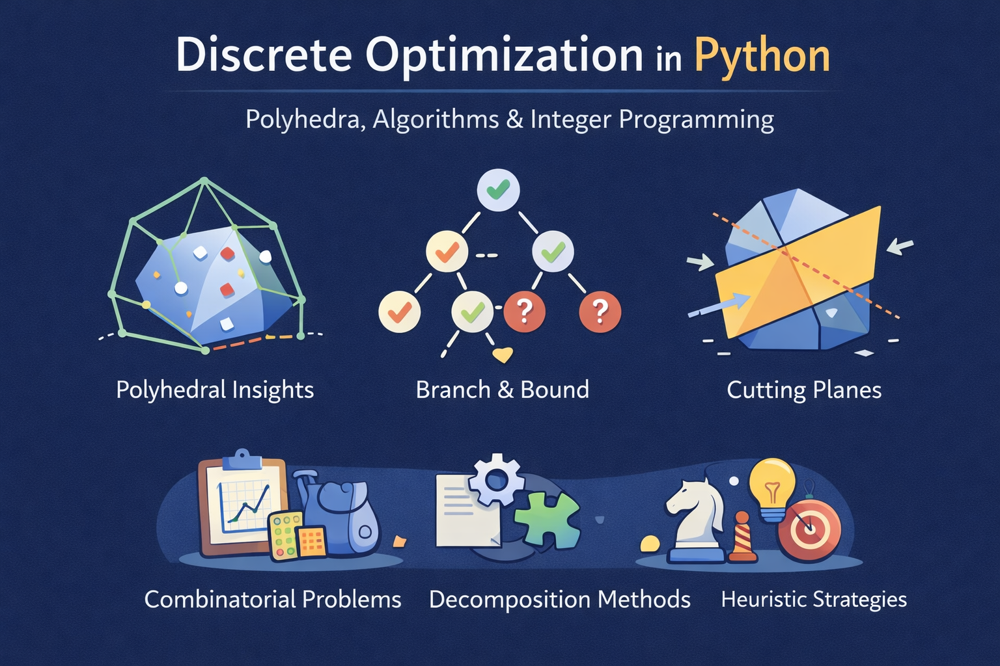

# Discrete Optimization In Python

A notebook-first tutorial for discrete optimization: polyhedral concepts, integer programming,
decomposition methods, and heuristics -- with Python implementations.

## Who this is for

You'll get the most out of this if you are already somewhat familiar with:
- Linear algebra basics
- Introductory linear programming (LP)
- Basic Python + NumPy knowledge

## Quickstart

1. Create and activate a virtual Python environment with `make install`. This will also install all necessary project dependencies into the virtual environment.
2. Start jupyter lab with `make lab`.

## Jupyter Book

The book can be built with `jupyter-book build . --config docs/_config.yml --toc docs/_toc.yml --path-output docs` \
The underlying Sphinx framework supports incremental builds, only rebuilding pages that changed.
   
## Walkthrough

For the complete tutorial, please work through the notebooks in the following order:
1. [01-Introduction](notebooks/01-Introduction.ipynb)
2. [02-Fourier Motzkin Elimination](notebooks/02-Fourier-Motzkin-Elimination.ipynb)
3. WIP: [03-Affine Mappings and Polar Cones](notebooks/03-Affine-Mappings-and-Polar-Cones.ipynb)
4. WIP: [04-Interior and Exterior Representation](notebooks/04-Interior-Exterior-Representations.ipynb)
5. WIP: [05-The Integer Hull](notebooks/05-The-Integer-Hull.ipynb)
6. WIP: [06-Branch and Bound Method](notebooks/06-Branch-And-Bound.ipynb)
7. WIP: [07-Unimodularity and Dual Integrality](notebooks/07-Unimodularity-and-Total-Dual-Integrality.ipynb)
8. WIP: [08-Gomory Cuts](notebooks/08-Fractional-and-Mixed-Integer-Gomory-Cuts.ipynb)
9. WIP: [09-The Knapsack Problem](notebooks/09-The-Knapsack-Problem.ipynb)
10. WIP: [10-The Set-Packing Polytope](notebooks/10-The-Set-Packing-Polytope.ipynb)
11. WIP: [11-Lagrange Relaxation](notebooks/11-Lagrange-Relaxation.ipynb)
12. WIP: [12-Dantzig-Wolfe Decomposition](notebooks/12-Dantzig-Wolfe-Decomposition.ipynb)
13. WIP: [13-Bender's Decomposition](notebooks/13-Benders-Decomposition.ipynb)
14. WIP: [14-Heuristics](notebooks/14-Heuristic-Methods.ipynb)
15. WIP: [15-Other Heuristics](notebooks/15-Other-Heuristics.ipynb)

## Repository structure

* `notebooks/` -- The tutorial notebooks
* `docs/` -- Rendered website via Jupyter Book
* `src/` -- Reusable implementations used by notebooks (algorithms, utilities, etc.)
* `tests/` -- Test scripts for core functionalities and algorithmic implementations

## Pre-commit

This repository uses pre-commits to run a set of hooks before git commits.
This can be done manually by:
1. Setting up the hooks via `make precommit`
2. Running them with `pre-commit run --all-files`

The hooks include:
* **nbstripout** to remove notebook cell outputs and normalize metadata
* **ruff** for fast linting and fixing Python code and notebook cells
* **black** for formatting Python code consistently

## Contributing

PRs are welcome:
* Typo & code fixes, clarity improvements
* Repository structure/functionality improvements
* Additional exercises + solutions
* New notebooks with small reproducible examples
* Solver/modeling examples

## License

Licensed under MIT License.
